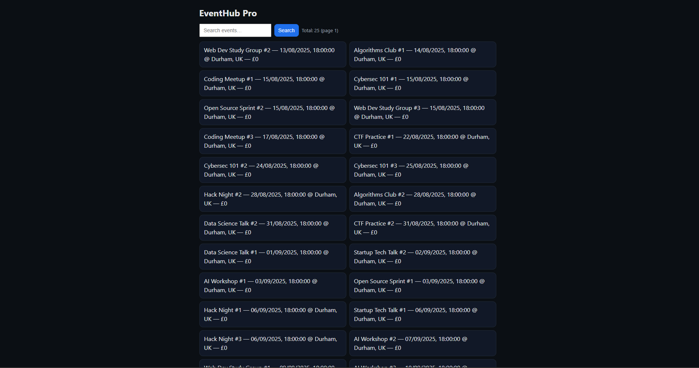

# EventHub Pro

Small events app I built to practise **Express + Prisma (SQLite)**.  
JSON API with **search + pagination** and a tiny **homepage** (plain JS/CSS).

---

## Features
- `GET /events?search=&page=&limit=` (paginated list; case-insensitive via `searchIndex`)
- `POST /events`, `GET /events/:id`, `DELETE /events/:id`
- Seed data: 25 Durham, UK tech/study events
- Minimal homepage that lists/searches events

---

## Quick Start

Prereq: **Node.js ≥ 18**

1) Setup and run

    cp .env.example .env
    npm install
    npx prisma generate
    npx prisma db push
    npm run db:seed
    npm start
    # Homepage: http://localhost:3000
    # API:      http://localhost:3000/events

Tip: `npx prisma studio` lets you view/edit the SQLite DB.

---
## Screenshots

## API (short)

Base: `/events`

- GET `/events?search=&page=&limit=` → `{ page, limit, total, totalPages, data:[...] }`
- GET `/events/:id` → one event or `404`
- POST `/events` (JSON):

      {
        "title": "Algorithms Club #1",
        "description": "Study session",
        "location": "Durham, UK",
        "startsAt": "2025-08-20T18:00:00.000Z",
        "endsAt": "2025-08-20T20:00:00.000Z",
        "price": 0
      }

- DELETE `/events/:id` → `204`

Examples:

    curl "http://localhost:3000/events?limit=5"
    curl "http://localhost:3000/events?search=web&limit=10"

---

## Structure

    .
    ├─ prisma/              # schema + seed
    ├─ src/
    │  ├─ app.js            # express app (helmet, cors, static)
    │  ├─ server.js         # start server
    │  ├─ lib/              # prisma client, pagination, validate, searchIndex
    │  ├─ routes/events.js  # API routes
    │  └─ public/           # index.html, app.js, styles.css
    └─ package.json
